# Using Tails When Your World Doesn't Feel Safe Anymore

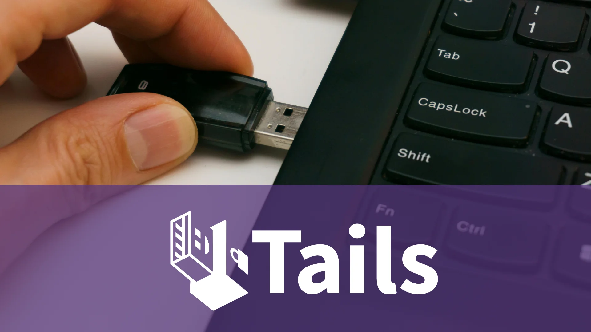
<small aria-hidden="true">Illustration: Jonah Aragon / Privacy Guides | Photo: Aleksander Dumała / Pexels</small>

There is a growing number of people who no longer feel safe in their own home or country. Whatever the reason, many people might not feel safe to browse certain topics online. With all the information getting collected for each internet search, it is difficult to access sometime vital information without leaving a trace. These digital footprints might not threaten your personal safety if you are living with a supportive family, and in a democratic and free country. However, there are situations where someone might be put in great danger simply for looking at a website.<!-- more -->

While this guide will be applicable to many, I am writing this article with these groups in mind:

1. Victims of domestic violence,
2. Trans and queer individuals living in a hostile environment, and
3. Democracy and human rights activists located in regions adverse to their cause.

This article will help people in such situations learn how to browse the internet and use a computer in a more protected and anonymous way, in order to stay safe from harm.

A warning for those at very high risk

If you feel at very high risk in your home or country, and the device you are currently using to read this article could be accessed by a person or group meaning you harm, I recommend you ask a *trusted ally* who does not experience the same level of threat to complete this tutorial for you on their device instead. This will help with minimizing any digital traces left on your device that could endanger you.

Then, I recommend that you [**erase your browsing history**](clearing-browsing-data.md) (ideally, delete this and related websites only) and clear your browser's cache and cookies. If you have a Google account and used Google to find this article, also make sure to [**delete your Google search history**](https://support.google.com/websearch/answer/6096136).

Once you have securely reached out to a trusted ally to request their help, and erased your browser's data for this site, do not consult this article again *if the digital traces of it might put you in danger*.

If you are completing this installation for someone else, or if the device you are currently using cannot put you at risk, here's why, when, and how you can install and use the portable system Tails:

## What is Tails?

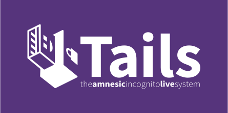

<small aria-hidden="true">Illustration: Tails / Tor Project</small>

Tails is a portable *operating system* (a type of software like Windows and macOS) that is especially designed to minimize your digital footprints while using it.

The name is an acronym for "The Amnesic Incognito Live System". It is kept on a USB stick and resets itself entirely after each use (except if you enable its encrypted password-protected [Persistent Storage](https://tails.net/doc/persistent_storage/index.en.html)). What is done on Tails does not leave any digital traces on the computer it is plugged into, hence "amnesic."

Additionally, Tails comes with pre-installed applications that will help increase your security and privacy online. When accessing the internet from Tails, your traffic will be automatically rerouted through the [Tor network](https://www.privacyguides.org/en/advanced/tor-overview/). This is a special network that makes it very difficult to identify your location or the websites you access, even from your Internet Service Provider (ISP).

However, unless you configure the [Tor bridge](https://tails.net/doc/anonymous_internet/tor/index.en.html#hiding) option to hide this, your ISP will know you have been using Tor, although they will not know which websites in particular you have visited through Tor. It could have been anything. I personally use Tor when I have to visit Google Maps, just to protect my data from Google's advertising.

## Why you might want to use Tails

There are many good and legitimate reasons for using Tails. Here are a few examples from the scenarios I am considering in this article:

1. A victim of domestic violence who needs a secure way to research and communicate with shelters or other supportive resources to plan a safe escape, without leaving traces of their activities on a device accessible to the perpetrator.

2. A trans or queer individual who lives with an unsupportive or hostile family and wishes to research trans or queer-related topics online, find communities, or access supportive resources without leaving any digital traces of their activities on a family device.

3. A democracy or human rights activist who organizes protests, communicate information online, or carry on any other activities that might have been declared unauthorized by an oppressive regime.

4. Any other situations where browsing the web or using a device anonymously might be necessary to protect someone's safety.

## When to use Tails, and when not to use Tails

Tails protects some data very well, but it will not magically protect everything. Before using it, read carefully what it can help you with and what it cannot do.

### When using Tails might help you

- Browsing the web without leaving traces on your main computer.

- Using a computer without leaving traces of your activities on your main computer.

- Storing information and processing files in an encrypted way, away from your main computer.

- Hiding which websites you visit from your ISP by using Tor, without leaving traces on your main computer.

### What you should be careful about

- Remember that unless you enable the Tor bridge, your ISP will know you have accessed the Tor network. Your government could request this information from your ISP. Be careful if this can put you in danger in your country. If you are not using Tails from a public Wi-Fi network, and if revealing to your ISP that you are using Tor could be dangerous to you, you should [enable the Tor bridge option](https://tails.net/doc/anonymous_internet/tor/index.en.html#hiding).

- Tails cannot protect your anonymity if while using Tails you log into an account that you have already been identified with, or have used outside of Tails. While using Tails, **do not log into anything that you have logged in outside of Tails**.

- If you communicate with others or create an account within Tails, be mindful not to share any personal details that could identify you while using Tails.

- If you share any files, be careful to **remove thoroughly any metadata** that could identify you from the file.

- If you share any pictures or videos, be extremely cautious with removing metadata and examining the picture or video to make sure no reflections or other details could inadvertently identify you.

- Do not to reuse any usernames, pseudonyms, email addresses, phone numbers, profile pictures, passwords, or any other information that you have used outside of Tails.

- Do not do anything that could identify you while using Tails. Assume that everything you do while using Tails could be linked together.

- Be careful with using any mobile data network to connect to the internet. Information related to [your mobile device could identify you](https://tails.net/doc/anonymous_internet/no-wifi/index.en.html).

- A very powerful adversary, such as a government, could potentially identify some information despite you using Tails. Read more about Tails' limitations here: [https://tails.net/doc/about/warnings/index.en.html](https://tails.net/doc/about/warnings/index.en.html)

### When you should **not** use Tails

- If someone finding your Tails USB stick could put you in worse danger than not using it at all.

- If you have not enabled the Tor bridge option, and your ISP or government finding out you have accessed Tor could put you in worse danger than not using it at all.

- When the computer you are using Tails with might be [compromised at the firmware or hardware level](https://tails.net/doc/about/warnings/computer/index.en.html).

- When there are cameras in your environment recording your activity on this computer.

- If your computer cannot securely boot from an external USB stick.

## Installing Tails

Before you start, make sure that:

1. The device you use for the installation is free from malware or spyware.

2. There is no recording software such as [Windows Recall](https://allthings.how/how-to-turn-off-windows-recall-ai-feature-in-windows-11-copilot-plus-pcs/) running. If there is, disable or pause it and delete your visit of this website from it.

3. You have a USB stick with a storage capacity of at least 8 GB. Ideally, I recommend using a fresh and new USB stick, but if this is not accessible to you, make sure you can erase this USB stick entirely and that the files on it were not sensitive or revealing information. Assume your USB stick could get seized later on and these deleted files could potentially get restored.

4. If you complete this installation for someone else, or if it is safe for you to do so (ordering online leaves a lot of digital footprints!), you may be interested in using a USB stick that looks more like a banal object. You can easily find cheap USB sticks on popular online stores that look like innocuous cartoon keychain charms, for example.

### What you'll need

- [x] USB stick with a storage capacity of at least 8 GB.

- [x] A computer with a port compatible with your USB stick (both for installation and usage).

- [x] A computer running one of these operating systems: Apple computer with *Intel* processor (not M1-M2-M3) running macOS version 10.10 or later, PC with at least 2 GB of RAM running Windows 7 or later, PC with at least 2 GB of RAM running Linux.

- [x] Capacity to install new software on the computer you are using for the installation.

- [x] At least 1-2 hours of free time when you are safe and free from threats.

Hardware incompatibility

You might experience some hardware incompatibilities while running Tails (this is common for Linux-based software on Mac devices). If this happens, you will need to use **a wired (or dongle) mouse, a wired (or dongle) keyboard, and a Wi-Fi adapter or an internet access you can plug in directly from an [Ethernet cable](https://simple.wikipedia.org/wiki/Ethernet)**.

If you need a Wi-Fi adapter, you will find a list of adapters compatible with Tails at the bottom of this page: [https://tails.net/doc/anonymous_internet/no-wifi/index.en.html](https://tails.net/doc/anonymous_internet/no-wifi/index.en.html)

Be very careful if you decide to use mobile phone connectivity, however. The data linked to your mobile device could de-anonymize you, even while using Tails. More information on this here: [https://tails.net/doc/anonymous_internet/no-wifi/index.en.html](https://tails.net/doc/anonymous_internet/no-wifi/index.en.html)

Delete your traces afterward

Depending on your situation, you might want to delete the traces of this installation after. See [a to-do list](#final-notes) for this at the end of this article.

About this tutorial

I am going to walk you through a **step-by-step through the process for an installation from macOS**. If you are using a computer running Windows or Linux, the steps will be similar, but the windows appearances and warnings will vary. The steps to boot from an external USB stick will also vary.

You might decide to reference the [guides from the Tails website](https://tails.net/install/index.en.html) instead. Tails' installation guides are excellent.

If you encounter any issues during the installation or running processes, you can try to find support specific to your issue here: [https://tails.net/support/index.en.html](https://tails.net/support/index.en.html)

### Step 1: Download Tails

Visit this website and select your installation computer's operating system: [https://tails.net/install/](https://tails.net/install/)

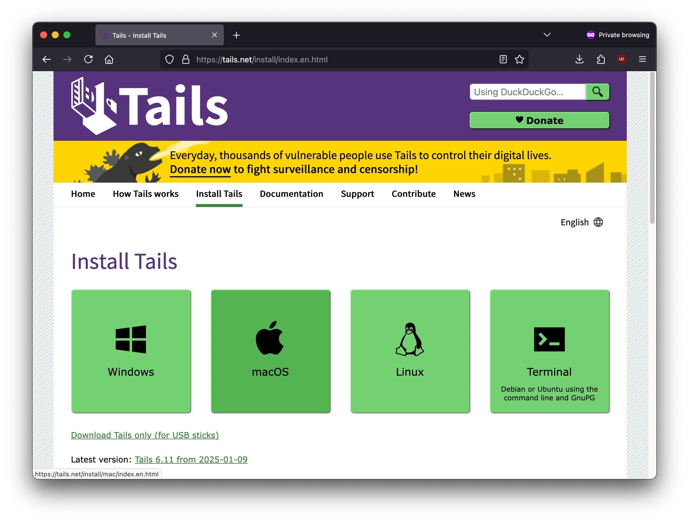

Scroll down to the "**Download Tails**" section and click on the green download button. Make sure to save the installation file in a folder where you can find it back easily and not forget to **delete it afterwards**.

Warning

Do not save this file on your USB stick!

Always install the latest version of Tails

The download link is not shared directly here because you should always make sure to download and install [the most recent version of Tails](https://tails.net/doc/upgrade/). If you read this article at a later date, the version number you will be installing will likely be higher than the number shown here.

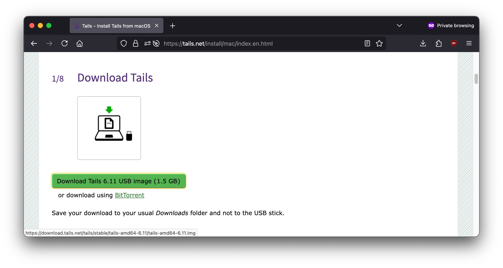

### Step 2: Verify the file you just downloaded

Scroll down to "**Verify your download**" and click on "**Select your download to verify...**"

Do not skip this step!

This step is important to ensure the file you just downloaded has not been tampered with or corrupted during the process.

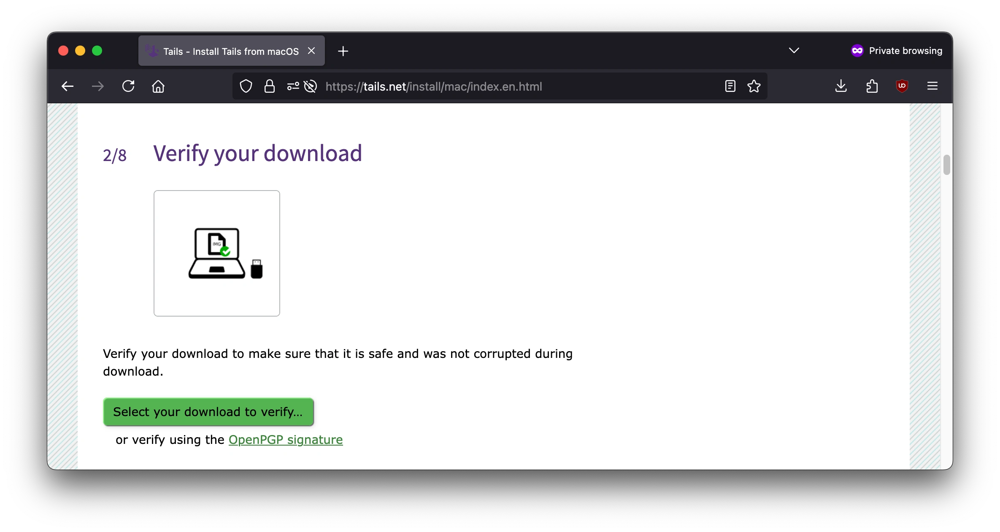

Once the verification is completed (this might take a few minutes), you should see a green checkmark with "**Verification successful!**" followed by the file name. If you do not see this, delete the file and repeat [Step 1](#step-1-download-tails) and [Step 2](#step-2-verify-the-file-you-just-downloaded).

### Step 3: Download and install balenaEtcher

You will need this free software in order to install Tails on your USB stick.

Reminder

Make sure the USB stick you have has a storage capacity of at least 8 GB, and does not store any files you wish to keep. Ideally, use a fresh never-used-before USB stick.

You can download *balenaEtcher* from this link: [https://tails.net/etcher/balenaEtcher.dmg](https://tails.net/etcher/balenaEtcher.dmg)

Open the folder where you downloaded the *balenaEtcher* installation file (keep it open to delete this file after the installation is completed), and double-click on the "**balenaEtcher.dmg**" file. Drag the "**balenaEtcher.app**" icon over the "**Applications**" folder icon when prompted from the window below:

Once the file is copied to you "**Applications**" folder, go on your computer's desktop and right-click on the "**balenaEtcher**" icon. Select '**Eject "balenaEtcher"**'

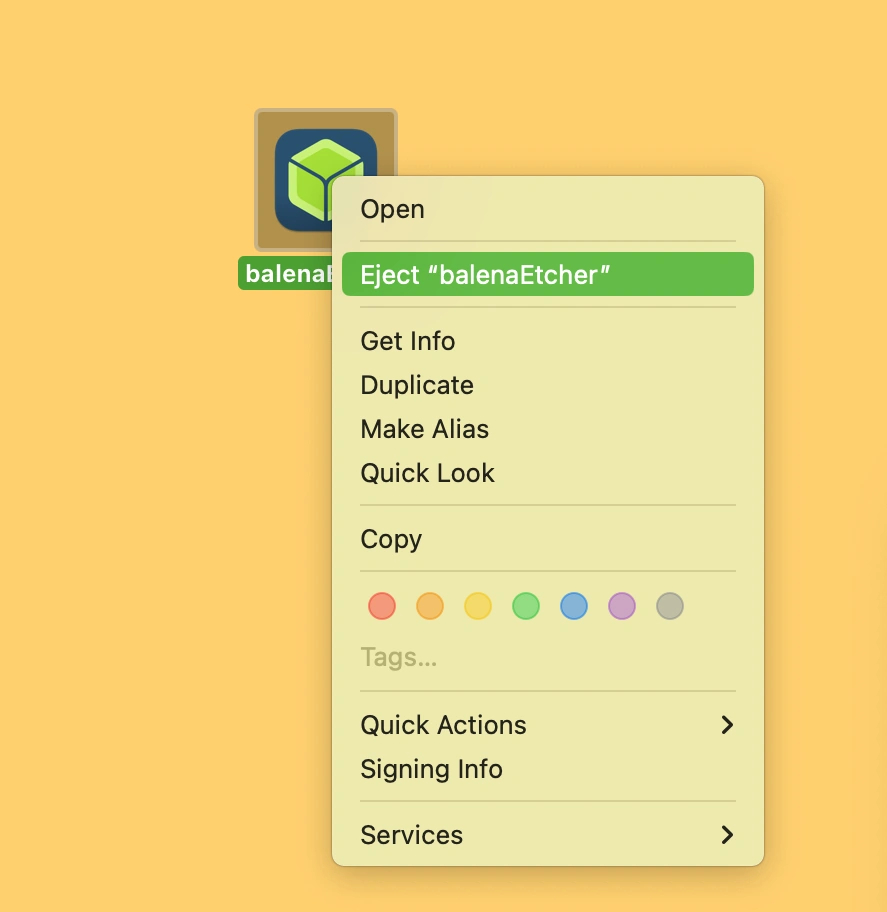

### Step 4: Install Tails on your USB stick using balenaEtcher

4.1. Open your Mac's "**Applications**" folder and double-click on "**balenaEtcher.app**".

Depending on your macOS version, your Mac might open a popup window saying '**Verifying "balenaEtcher.app"...**'. This is normal, let it complete its verification. Next, you will likely see another popup window with '**"balenaEtcher.app” is an app downloaded from the Internet. Are you sure you want to open it?**'. Click "**Open**".

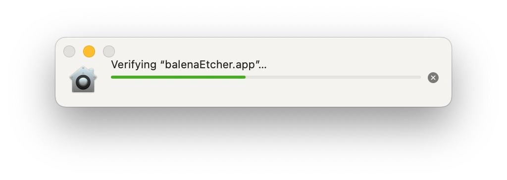

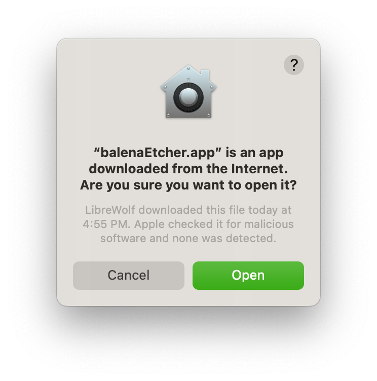

4.2. Open *balenaEtcher* and click on the settings gear button on the upper-right. Disable the option "**Anonymously report errors and usage statistics to balena.io**", then click "**OK**".

4.3. Eject and unplug any other external USB stick(s) or external USB drive(s) that might be plugged into your computer if possible, and plug in the USB stick you wish to erase and install Tails on.

4.4. Once it is plugged in, return to *balenaEtcher* and click on the "**Flash from file**" blue button on the left. You will be prompted to select a file. Select the Tails "**.images**" file you have downloaded and verified earlier.

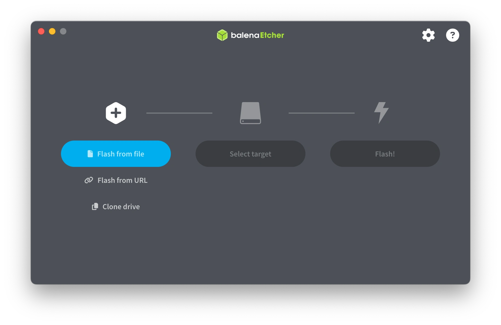

4.5. Click on the "**Select target**" blue button in the middle, and select your USB stick.

Caution! Select the correct USB stick!

Make sure you are not selecting a USB stick or drive different from the one you wish to erase for Tails. **All data on the USB stick or drive you select will be permanently lost. Be careful!**

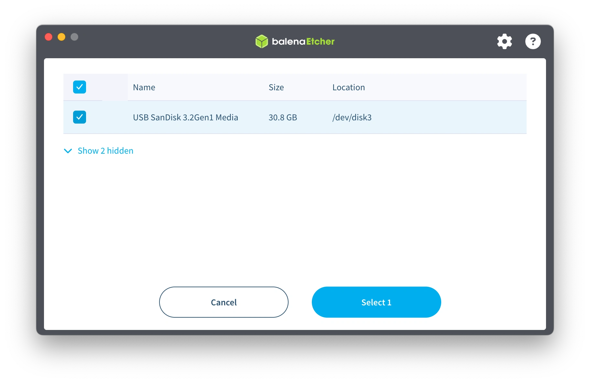

4.6. Once you have verified that all the information is correct, click on the "**Flash!**" blue button on the right.

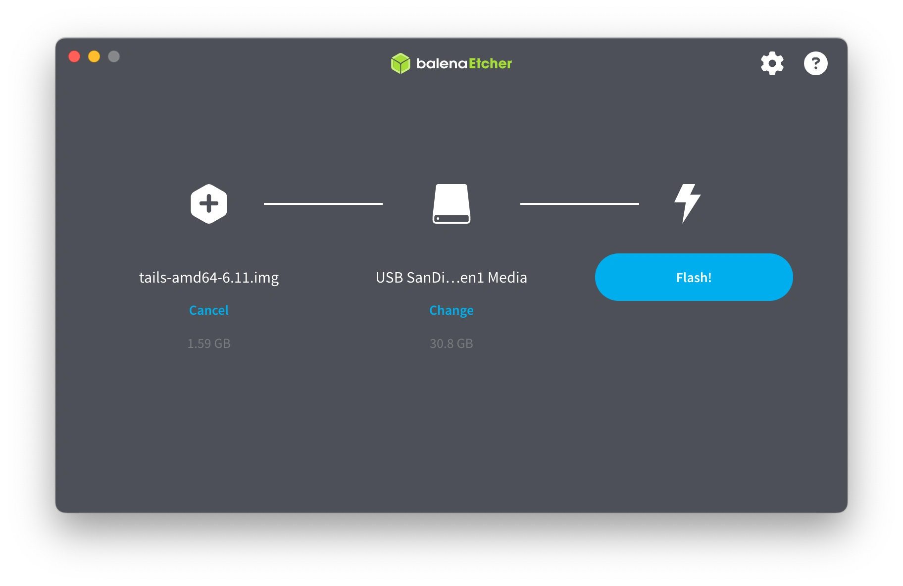

You will see a *balenaEtcher* popup window saying: "**balenaEtcher needs privileged access in order to flash disks. Type your password to allow this.**". Type your computer's password and click "**Ok**".

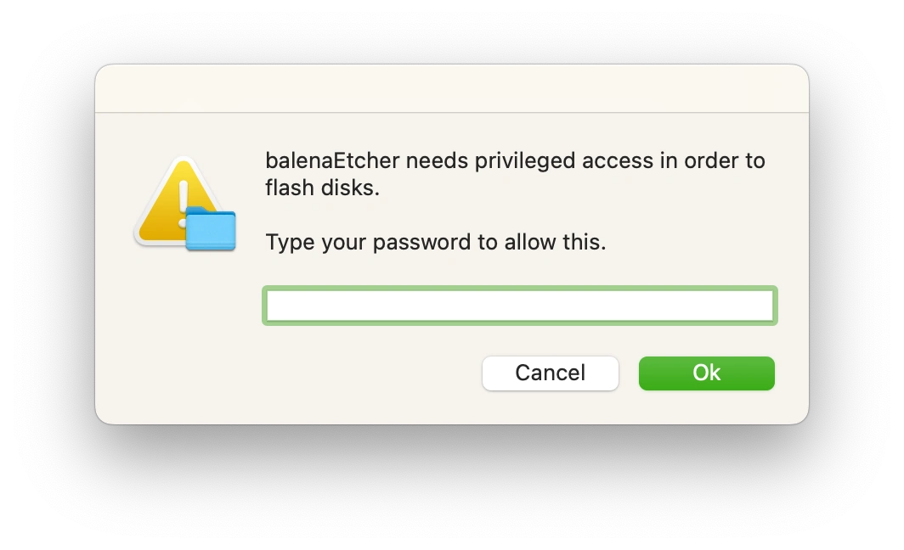

Depending on the version of macOS you use, you might see another popup window saying '**"balenaEtcher.app" would like to access files on a removable volume.**'. Click "**OK**" and wait for the installation to start.

While Tails is getting installed, you should see a window that looks like this with "**Flashing...**". The operation might take a few minutes. Do not interrupt this process!

4.7. Once Flashing is completed, you will see *balenaEtcher* validating the installation with "**Validating...**". This process should be quick.

Failed validation

If the validation fails, close *balenaEtcher*, eject your USB stick, and try the installation process again from [Step 4](#step-4-install-tails-on-your-usb-stick-using-balenaetcher). You may also want to try with a different USB port or a different USB stick.

Once the installation is completed successfully, you should see a window like this with "**Flash Completed!**" on the left. You can now close *balenaEtcher* and unplug your USB stick.

Unreadable USB

If you see a notification about a USB stick that appears to be unreadable, click "**Eject**" and unplug your USB stick.

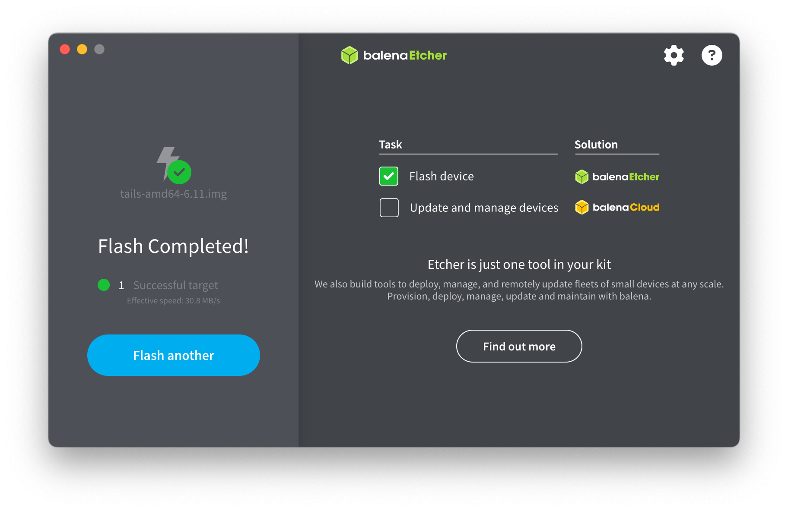

### Step 5: Continue this tutorial from paper or from another device (if you can do so safely)

For the rest of this tutorial, you will have to shut down the computer you will be using or testing Tails with. If this is the same computer you are currently using, you will need an alternative way to keep following along with the instructions. Make sure you either:

- Note the rest of the instructions in advance on something that will be easy to delete/erase/destroy after.

- Open this article on a mobile device where it is not dangerous for you to visit this page.

### Step 6: Boot your computer from your Tails USB stick

Warning: If the computer running Tails is a Mac with a T2 Security Chip (2018-2020):

If the computer you will be using Tails with is a [Mac with a T2 Security Chip](https://support.apple.com/en-us/103265), and you receive the following message (or similar) when trying to boot your Mac from your Tails USB stick:

`Security settings do not allow this Mac to use an external startup disk.`

Here's how to modify options in your Mac's [Startup Security Utility](https://support.apple.com/en-us/102522) to make this works:

1. Turn off your Mac, then turn it on again and right away press and hold **Command(⌘)+R**, this will enter your Mac's recovery mode. The startup process will take longer than usual, and you will see the screen flashing a few times, this is normal.

2. You will see a "**Language**" menu appear, select a language then click on the arrow at the bottom-right.

3. If your computer has multiple volumes (disks), you will be required to select one, then click "**Next**".

4. You will need to select a user you know the password for and enter it, then click "**Next**".

5. Once you see a window with 4 options, select none of these and instead go to the upper-left menu to select the "**Utilities**" drop-menu, then select "**Startup Security Utility**".

6. You will see an "**Authentication Needed**" window appear, and you will need to enter your macOS user password again.

7. Once you see the "**Startup Security Utility**" window with 5 options, in the "**Secure Boot**" section select "**No Security**" and in the "**External Boot**" or "**Allowed Boot Media**" section select "**Allow booting from external or removable media**".

Security warning!

This reduces the security of your device because your computer could boot from anything else as well. You could "Turn On Firmware Password" at the top to mitigate this, however, if others use this device, I would recommend that you do not do this. Enabling a firmware password would require this new password to be entered [each time this device starts from a different disk](https://support.apple.com/en-us/102384). This could raise a lot of suspicions if there was no password before.

Moreover, if you ever lose this password, you would be entirely locked out of this device and require an in-person service at the Apple Store to be able to keep using it.

If you want to hide that you are using Tails from the people near you, I would recommend you do **not** turn on firmware password. However, do know this could increase some security risks for this device.

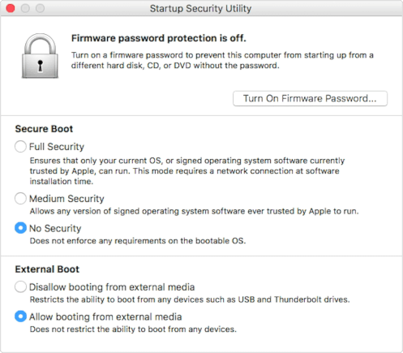

<small aria-hidden="true">Screenshot: Tails / Tor Project</small>

Quit Recovery Mode

Once you have modified your "**Startup Security Utility**" options, click on the drop-down Apple menu (apple icon) of the upper-left, then select "**Shut Down**".

To boot from your Tails USB stick:

**From macOS:**

1. Shut down your computer.
2. Plug in your Tails USB stick.
3. Turn on your Mac, then right away press and hold the "**Option**" key (⌥ or Alt key) until you see a loading bar or a disks menu.
4. When you see a disks menu, select the yellow disk called "**EFI Boot**" or "**Windows**".

No disks menu?

If you do not see this disks menu, wait 2-3 minutes, shut down your computer, unplug your USB stick, plug it in another port if you can, and start the boot process over.

**From Windows 8 or 10:**

1. From Windows or the sign-in screen, click on the "**Start**" button.
2. While you choose "**Power**" > "**Restart**", press and hold the "**Shift**" key.
3. Once you get to the "**Choose and option**" screen, select "**Use a device**"
4. In "**Use a device**", select "**Boot Menu**" and plug in your Tails USB stick while Windows is shutting down.

Boot Step 3: No device selection menu?

If you do not see this, follow these instructions from Tails: [https://tails.net/doc/first_steps/start/pc/index.en.html#boot-menu-key](https://tails.net/doc/first_steps/start/pc/index.en.html#boot-menu-key)

Boot Step 4: No boot menu?

If Windows does not display a "**Boot Menu**", plug in your Tails USB stick then select it directly from the list of devices. Press "**Enter**".

**From Linux:**

1. Shut down your computer.
2. Plug in your Tails USB stick.
3. Identify the Boot Menu key for your specific computer manufacturer. You can see a list of the most common ones here: [https://tails.net/doc/first_steps/start/pc/index.en.html#boot-menu-key](https://tails.net/doc/first_steps/start/pc/index.en.html#boot-menu-key)
4. Turn on your computer and immediately press and hold this identified Boot Menu key.

## Starting and using Tails

If the installation was successful and the process of booting from the USB stick went well, you will see Tails starting. You will see some gray screens, you will see some flashes, you will see some black screen with lots of white text rolling down very quickly!

Don't panic! This is normal :thumbsup:

Once Tails has started, you will see a top menu bar with a blue wallpaper. It might take a few minutes before you see a window popping up there, this is also normal. Be patient.

The first window you should see is a window saying "**Welcome to Tails!**"

There, you will see language options, the [Persistent Storage](https://tails.net/doc/persistent_storage/index.en.html) option, and Additional Settings options.

No keyboard! No mouse!

At this point you might realize your mouse and/or keyboard are not working. If this happens, you can use a wired (or dongle) mouse and a wired (or dongle) keyboard to fix this problem quickly. If it is still not working after plugging one in, leave all peripherals plugged in and restart Tails (see [Step 6](#step-6-boot-your-computer-from-your-tails-usb-stick)).

### Using Persistent Storage

Make sure to test this feature works well multiple times before storing anything of value there. If you forget the Persistent Storage's password or if a bug occurs, you might not be able to access these files anymore. Know that you also have the option to plug in a separate (ideally encrypted) USB stick to store files on it, even while using Tails. If you encounter a problem when using Tails' Persistent Storage feature, you can troubleshoot it here: [https://tails.net/doc/persistent_storage/fsck/index.en.html](https://tails.net/doc/persistent_storage/fsck/index.en.html)

If you decide to set up Persistent Storage:

1. Choose a long passphrase that is **not** something known like music lyrics or movie quotes. Choose something you do not usually say/write and that you could not Google. Choose **something long and unique**, that nobody else has used before, and that you will be able to remember well. Practice this passphrase in your head regularly.

2. After setting up Persistent Storage, you will see a window like this with additional options:

### Connecting to the internet

Make sure that your Wi-Fi card, Wi-Fi adapter, or Ethernet cable is plugged in and working. On the upper-right menu bar, click on the onion icon and select "**Open Tor Connection Assistant**". You will see a "**Tor Connection**" window appear with a few options. If it is not dangerous for you to have your ISP or government know you are using the Tor network, choose "**Connect to Tor automatically**" then click on "**Connect to Tor**".

Danger!

If using Tor is dangerous for you, read more about the other options before deciding anything.

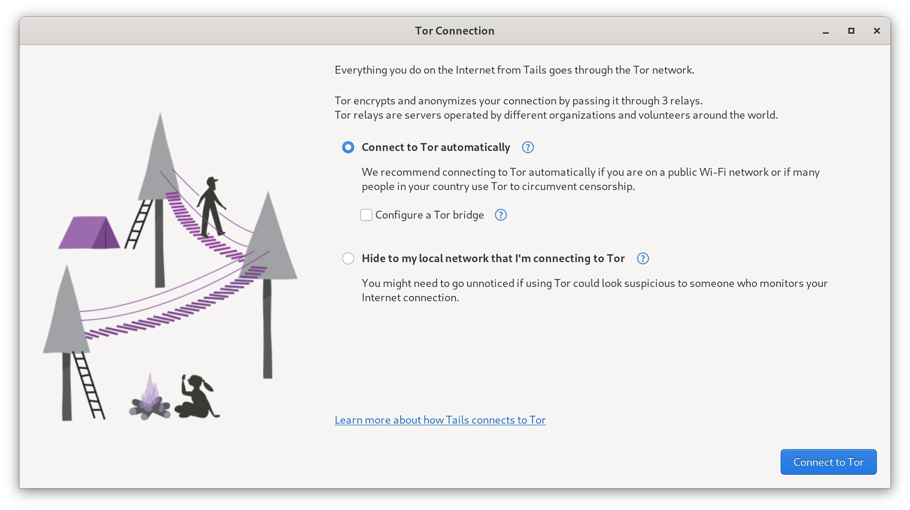

If the connection is successful, you should see this window, and you will be ready to browse the internet anonymously:

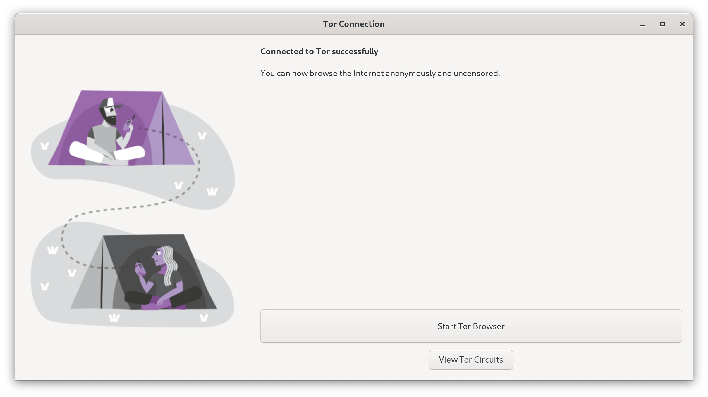

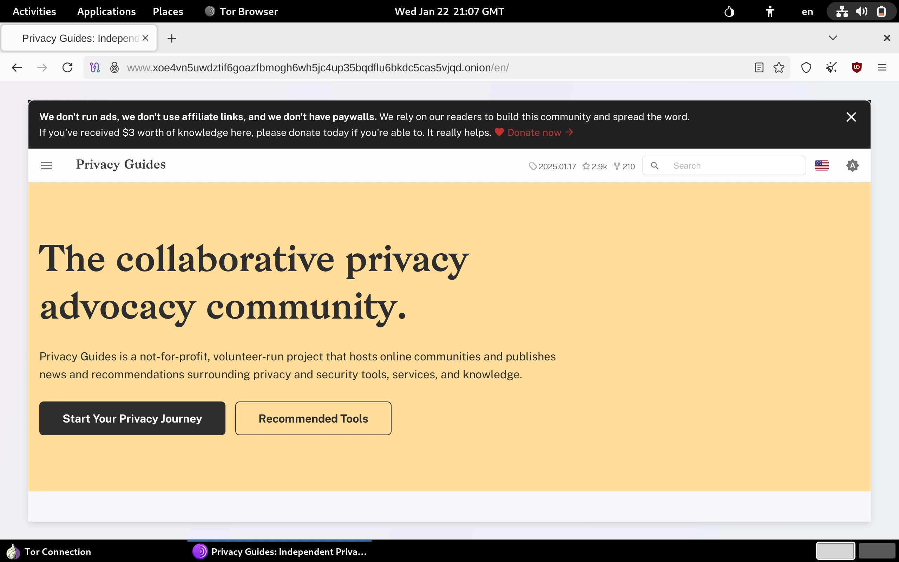

### Sharing files with others

There is a lot of great applications already installed on Tails to help you! You will find them listed in the "**Applications**" drop-menu on the upper-left top bar. One of these applications is [OnionShare](https://onionshare.org/), which you can use to share files with others anonymously.

### Storing passwords

If you are using the Persistent Storage with Tails, and need to store passwords, you can use the pre-installed [KeePassXC](https://keepassxc.org/) application. This application will store your passwords encrypted, locally-only, and protected by a main password (ideally, a **passphrase**). Be careful however if you store important passwords in there. Remember that if a bug occurs or if you forget your Persistent Storage's password, you could lose access to all of it.

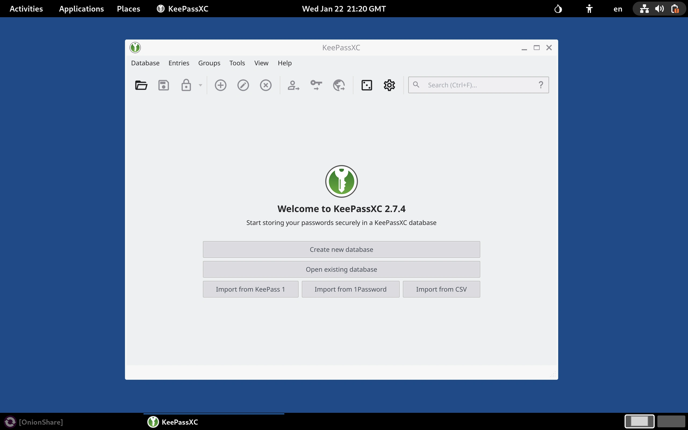

### Shutting down Tails

When you are done using Tails, you should always **shut it down and unplug the USB stick** after.

To shut Tails down, click on the upper-right menu on the top bar, the one with the battery icon. Then click on "**Power Off**" at the bottom-right of the drop-menu box. Wait for the screen to turn black, then unplug your Tails USB stick.

In Case of Emergency!

In case of emergency, you can shut down Tails quickly by directly unplugging the USB stick while it is still running. This will effectively reset Tails like a normal shut down **IF** it was not in "Suspend" state. More on this here: [https://tails.net/contribute/design/memory_erasure/](https://tails.net/contribute/design/memory_erasure/)

Shutting down Tails by physically unplugging it while it is still running [could potentially damage your Persistent Storage](https://tails.net/doc/first_steps/shutdown/index.en.html). Only use this feature in case of emergency, and shut down Tails using the "**Power Off**" menu option whenever possible.

## Final notes

Remember to delete the traces of this installation from the computer you used, once you have verified that everything works properly.

**You should also remember to:**

- [x] Delete the browsing history for these websites (this article, the Tails web pages, and any other related pages you have visited).
- [x] Delete cookies for these websites (or all cookies).
- [x] Delete the site data and cache for these websites (or all sites data).
- [x] If logged into your Google account, [delete your Google search history](https://support.google.com/websearch/answer/6096136) for these websites.
- [x] Delete *balenaEtcher*, both the software and the installation files (after verifying your Tails is operational).
- [x] Delete *balenaEtcher* from the recently used applications list.
- [x] Empty your computer's trash bin.
- [x] Once you have completed this list and verified your installation, reboot your computer.

### Consider supporting Tails and the Tor Project

Finally, if you are not personally at risk of harm by reading this article or by getting associated with Tails, I strongly encourage you to support this incredible project by donating to Tails or to the Tor Project. Tools like Tails and Tor help a lot of people in very vulnerable situations. Your support means a lot to non-profit organizations like the Tor Project to improve and maintain these tools.

Thank you for helping yourself and others to stay safe :purple_heart:

Support Tails (if it is safe for you to do so): [https://tails.net/donate/](https://tails.net/donate/)

Support the Tor Project (if it is safe for you to do so): [https://donate.torproject.org/](https://donate.torproject.org/)

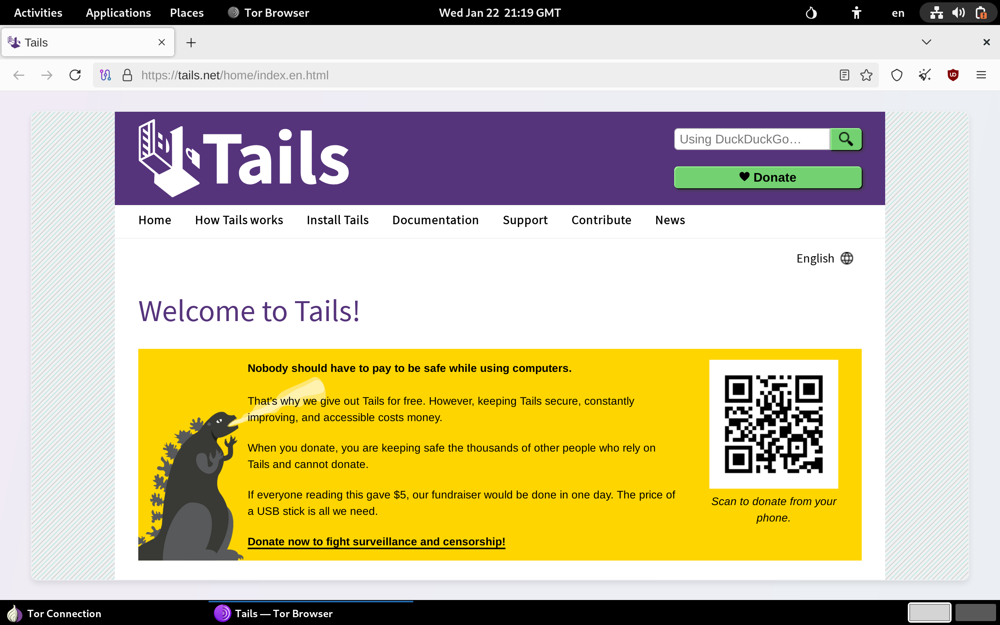

<small aria-hidden="true">Unless credited otherwise, all screenshots from: Privacy Guides</small>
