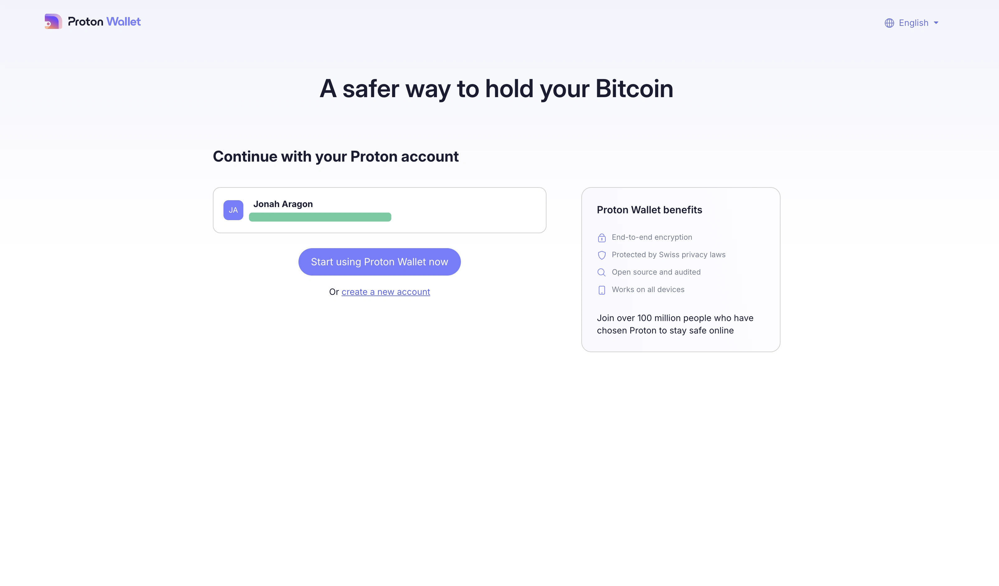
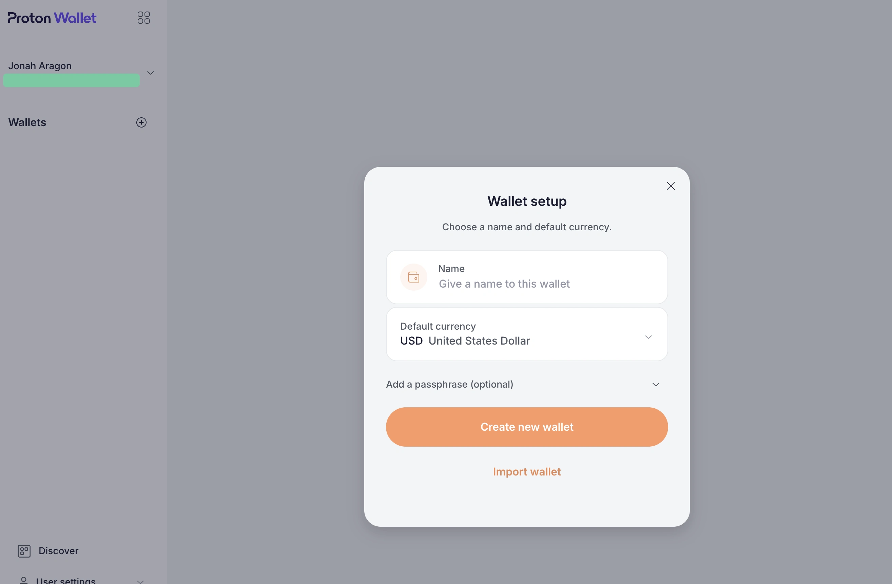
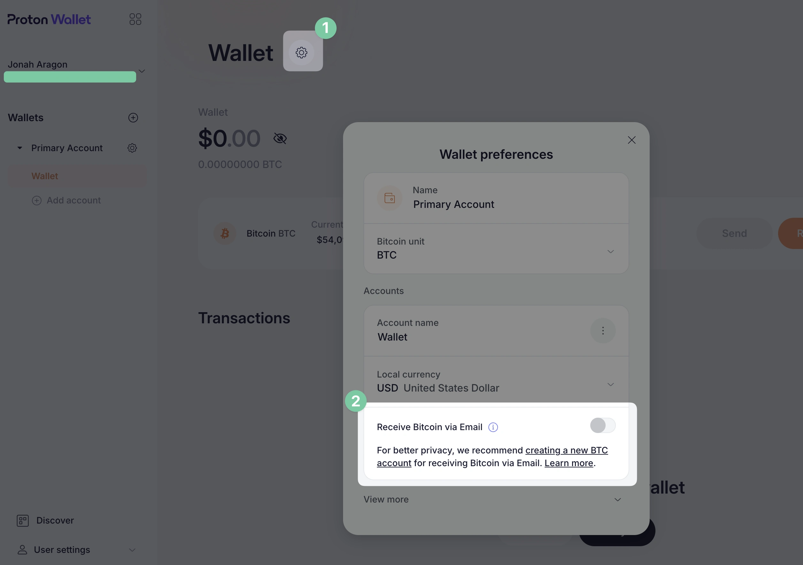

{ align=right itemprop="image" }

Proton, the Swiss creators of privacy-focused products like [Proton Mail](https://www.privacyguides.org/en/email/#proton-mail) and [Proton VPN](https://www.privacyguides.org/en/vpn/#proton-vpn), recently released the latest product in their ever-growing lineup: **Proton Wallet**. [Announced](https://discuss.privacyguides.net/t/introducing-proton-wallet-a-safer-way-to-hold-bitcoin/19636) at the end of July 2024, it promotes itself as "an easy-to-use, self-custodial" Bitcoin wallet that will ostensibly make financial freedom more attainable for everyone.<!-- more -->

!!! info inline "Side info"

    - Proton Wallet's [Privacy Policy](https://proton.me/wallet/privacy-policy)
    - This review was conducted with the reviewer's personal Proton Visionary account. Proton was not contacted prior to this publication.

It may well be that Proton Wallet is the easiest way to start using Bitcoin, but is a Bitcoin wallet the solution people need to improve their financial privacy?

## A cryptocurrency primer

Contrary to popular belief, [cryptocurrency](https://www.privacyguides.org/en/cryptocurrency/) is not an inherently private transactional system.

The vast majority of cryptocurrency, including Bitcoin, uses a transparent and public blockchain as the ledger for all transactions. This means that anyone you've transacted with or who knows your wallet's public address can trivially trace all of your past transactions, and monitor all of your future transactions at any time.

This is a huge problem for Proton Wallet, because Bitcoin is the **only** cryptocurrency it supports. Furthermore, Proton Wallet doesn't support the few privacy-enhancing additions to Bitcoin that do exist, like CoinJoin or even the Lightning Network. While these technologies still don't bring Bitcoin close to the levels of privacy attainable with some alternatives like Monero, to see them lacking in a product from a privacy-centric company like Proton is extremely disappointing.

Proton has claimed in a few interviews that they chose Bitcoin because of its mass appeal, and it's certainly true that Bitcoin has the mind share and market share to beat out any other cryptocurrency, but the *most popular* option isn't always the *best* option.

Had Proton Wallet added support for Monero or a similarly private cryptocurrency, they could have single-handedly boosted a financial system that is *actually* private by default by a significant degree. In my eyes, failing to do so in favor of the market leader is an unfortunate step back from their "privacy by default" mantra.

## Using the app

Proton Wallet *is* in beta, like many of Proton's products are when newly released, and available via the web, an Android app, and an iOS [TestFlight](https://testflight.apple.com/join/6OIcXtQN).

Creating your wallet is a simple process, after registering you'll be asked to choose a name for your wallet and a default currency. You can also optionally set a passphrase to secure your account. Note that this isn't merely a passphrase securing your account on Proton's servers beyond your usual account credentials, it's a [BIP39 extension word](https://en.bitcoin.it/wiki/Seed_phrase#Two-factor_seed_phrases), meaning that if you lose it your wallet will be completely unrecoverable, **even if** you back up your 12 word seed phrase.

The default currency here isn't the currency being *stored* in Proton Wallet. It is just used to show you the current conversion rate between Bitcoin and your local currency.

Once you're in, Proton Wallet is fairly straightforward. In fact, there's not much to explore beyond finding your wallet address and buying Bitcoin. Clicking the **Receive** button brings up a panel which shows your address and allows you to generate a new one on the fly. When you generate a new address, all of your previous addresses will continue to work, but are no longer displayed anywhere.

Buying Bitcoin is simple as well. Proton is working with two providers, Banxa and Ramp, and if you're in the United States like I am both are available, so you can choose the one with the best exchange rate to go with. Before you purchase, Proton Wallet asks you for your current country, so that will determine which providers it's possible to use.

There's no private payment methods though, you're stuck with credit card, Google Pay, or Apple Pay. The purchase experience isn't quite seamless either, as it redirects you to either banxa.com or ramp.network to perform the actual transaction. Everything is pre-filled with your Proton Wallet information however, so it isn't a huge problem.

## "Bitcoin via Email"

The flagship feature of Proton Wallet is something they call **Bitcoin via Email**, which integrates with Proton Mail to allow you to send Bitcoin to any email address. Opening your wallet settings lets you enable Proton's *Receive Bitcoin via Email* feature, which allows other Proton Wallet users to send Bitcoin to your account with just your Proton Mail address.

If you have multiple addresses on your Proton account, such as aliases or addresses on a custom domain, only one address can be linked to your wallet. This can be a bit annoying for people who have given out different Proton addresses to others in the past, like if you gave out your @protonmail.com address to some people, before later migrating to @proton.me when that domain became available.

On the other hand, if you have aliases for different projects, this is a great way to keep Bitcoin payments to each address separate. If you have your personal email and a business alias for example, you can link your personal email to your primary wallet and create a second wallet to link your business alias to, thus keeping your personal and business transactions separate.

Proton says that you can "create as many wallets as your Proton Wallet plan allows," but the exact limits are not very clear at the moment. This may become clearer as Proton Wallet exits its beta status.

Sending Bitcoin to an email address is as simple as it is in mainstream payment apps like Venmo or CashApp, which is great. You can even include a memo with your transaction, and the transaction appears on the recipient's side very quickly. However, it can take a few hours or more for a transaction to actually complete and be usable by the recipient, so all they'll be able to do is monitor its progress in the meantime. This can be sped up by choosing a higher "network fee" when sending the payment, which costs more Bitcoin as the name would suggest.

I'm not convinced this is particularly revolutionary though. Many Bitcoin wallets have streamlined the process of exchanging address information with other people with methods like QR codes, which are likely going to be more widely used than email in today's mobile-first world. Being able to replace Bitcoin addresses with emails fairly seamlessly *is* nice, but is it nice enough to warrant the entire Proton Wallet product? I'm not so sure.

## What else sets it apart?

There isn't much separating Proton Wallet from the existing options on the market. It is a *noncustodial* wallet, meaning that you control the private keys rather than Proton. This is a huge step-up in security compared to keeping your Bitcoin in an online exchange like Coinbase, but it isn't a big differentiator from other software wallets where noncustodial key storage is typically the norm.

Besides that, and Bitcoin via Email, if you visit Proton's website to see how else they differentiate themselves the best third reason they could muster up is:

> Our business is privacy: Proton isn't a crypto company — we're a privacy company that wants to empower everyone to use Bitcoin securely and privately.

Unfortunately for Proton, this doesn't quite ring true when it comes to Proton Wallet. When it launched in 2014, Proton Mail was revolutionary in the email space. Encrypted email providers already existed, but Proton offered something different: Proton brought a good user experience to an interoperable encryption standard, PGP. While everyone else in the email space was rolling their own password-protected web portals to secure messages or simply delivering emails in plaintext, Proton built a user-friendly platform that actually improved the email ecosystem at large in the process.

Proton's leadership thinks they can do for cryptocurrency what they once did for email, but there's a clear difference between then and now. Proton Mail had privacy and security ready to go from the beginning, but Proton Wallet simply meets the status quo.

## Why does this exist?

Proton Wallet is in a strange position. I've spoken to a few sources who suggest that privacy features like CoinJoin, which can mix Bitcoin in order to better anonymize transactions, were intended to be included at launch. The [crackdown](https://bitcoinmagazine.com/legal/samourai-wallet-breaking-down-dangerous-precedents) on the ill-fated Samouri Wallet project by U.S. authorities last April certainly put a damper on privacy in the Bitcoin space, and likely made Proton wary of introducing such features to the public.

Proton suggests this themselves, stating on their [website](https://proton.me/wallet/bitcoin-guide-for-newcomers):

> Coinjoin is considered the best solution for improving blockchain privacy. It works by mixing your BTC with other users’ BTC in a collaborative self-custodial transaction where you get back the same amount of BTC that you put in but on a different address that cannot be easily linked to your previous address. However, in 2024, in what many consider to be a regulatory overreach and attack on privacy, some of these Coinjoin services have been declared illegal in the US and EU. The future of financial privacy may therefore be decided by ongoing litigation in the next decade and privacy advocates should support these efforts.

This situation likely soured Proton on other privacy-friendly cryptocurrencies like Monero as well. I get it, financial privacy is an extremely challenging task for any company to take on. We can't expect Proton to take on the risk of offering a completely anonymous payment service in the current legal climate, but it begs the question: why enter the financial space at all?

Proton Wallet seems like a product that doesn't know its own place in the world. Is it meant to save us from the tyranny of payment processors like PayPal who can freeze your funds at a whim? Proton certainly thinks so, having faced that exact problem themselves during their original 2014 crowdfunding campaign. But in that case, is Bitcoin the actual solution to this problem, or is it just a stopgap fix that Proton happened to latch on to way back in 2014 when Bitcoin was more *in vogue* and there were few competitors?

Today, there are many alternatives to Bitcoin which are safer to store your money in while remaining protected from intrusive fintech companies like PayPal. Stablecoins like USDC can be traded on multiple cryptocurrency networks without the need for middlemen payment processors, and can be exchanged at a variety of exchanges with the huge benefit of having *significantly* less risk than Bitcoin, theoretically no risk at all. Support for USDC or a similar technology would go a long way towards enabling *usable* cryptocurrency transactions for everyday users, even though USDC doesn't have any additional privacy protections either.

Or, was Bitcoin chosen to give us independence from fiat currency, including stablecoins, entirely? Maybe so, but is that something we actually want? Prepping for a worldwide market collapse is perhaps a bit of a fool's errand. If the US Dollar and other economies failed overnight, I think we would all have a lot more problems than Bitcoin is going to solve for us. Bitcoin is a poor store of value to serve as an alternative to traditional currency anyway. Any asset which can gain or lose half its purchasing power on any given day of the week simply can't function as a viable medium of exchange, meaning it's virtually useless for day-to-day transactions.

However, if Proton Wallet wasn't meant for all that, if it was simply meant to bring privacy to Bitcoin, then it's certainly a failure. Proton hasn't taken any risks with this product, meaning it's really only good for satisfying a singular belief: That Bitcoin is just inherently good, and anything to promote Bitcoin is inherently good as well. I don't share these fanatical beliefs of *Bitcoin maximalists*, however, when Bitcoin is demonstrably lacking in a wide variety of ways.

## Conclusion

Personally, I'm a bit of a cryptocurrency pessimist in general, but I can see some appeal for the technology in very specific areas. Unfortunately, Proton Wallet doesn't seem to fit in to a useful niche in any meaningful way. The functionality it does support is extremely basic, even by Bitcoin standards, and it simply doesn't provide enough value over the existing marketplace.

If you're an existing Proton user simply looking for a place to store some Bitcoin *you already have* sitting around, Proton Wallet might be perfectly adequate. For everyone else, I don't see this product being too useful. Bitcoin is still far too volatile to be a solid investment or used as a safe store of value if you crave financial independence and sovereignty, and Proton Wallet simply isn't adequate for [paying for things privately online](https://www.privacyguides.org/en/advanced/payments/).

There is some potential with Proton Wallet. Personally, I would like to see [support for Monero](https://protonmail.uservoice.com/forums/960668-proton-wallet/suggestions/48672359-support-monero), a cryptocurrency that has privacy features built-in by default. There is also the possibility of Proton expanding into the *traditional* finance space with features like a digital wallet for credit/debit cards, card aliasing à la [privacy.com](https://www.privacyguides.org/en/financial-services/#privacycom-us), and tap to pay within their mobile apps. A third-party alternative to Apple Pay and Google Wallet, and for the first time ever such a product could actually be viable: It's always been possible on Android, but just last month Apple announced the possibility for [iOS developers to use NFC](https://www.apple.com/newsroom/2024/08/developers-can-soon-offer-in-app-nfc-transactions-using-the-secure-element/) to facilitate payments outside of Apple Wallet. This presents a golden opportunity for Proton Wallet to be the first cross-platform digital wallet, if they can deliver.

Alas, none of this is available in Proton Wallet today, and that's all that really counts.
